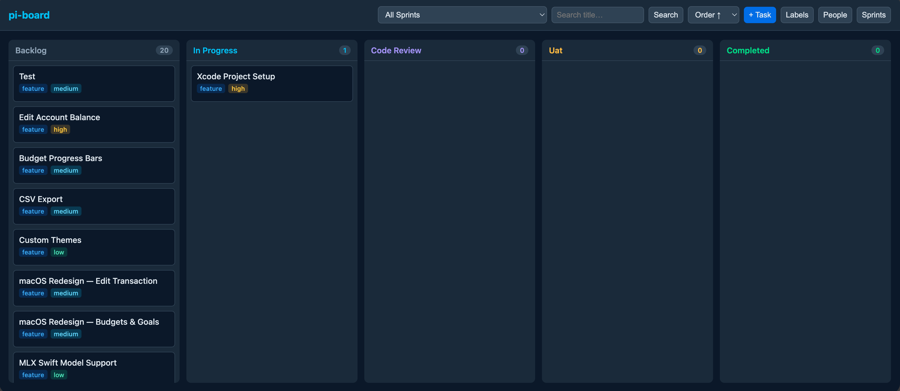

# pi-board

AI-first local task and sprint manager with a Kanban web UI. Manage tasks through conversational AI tools or a drag-and-drop board in your browser.



## Installation

### From npm

```bash
pi install npm:@jpballares/pi-board
```

### From GitHub

```bash
pi install git:github.com/JPBallares/pi-board
```

### From local path (development)

```bash
pi install /path/to/pi-board
```

## Quick Start

1. Install the package (see above).
2. Start the board server:
   ```
   /board
   ```
   This opens `http://localhost:3333` in your default browser.

3. Create your first sprint and tasks via AI or the web UI.

## Web UI

Open the Kanban board with `/board` or visit `http://localhost:3333`.

### Features

- **Kanban columns**: Backlog → In Progress → Code Review → UAT → Completed
- **Drag & drop**: Move tasks between columns; changes persist immediately
- **Task detail modal**: Click any card to view and edit all fields inline
- **Search**: Filter tasks by title (submit-based)
- **Sort**: By priority, order, or creation date — preference saved to `localStorage`
- **Labels**: Create colored labels and attach them to tasks
- **People**: Create assignees with colors; assign during task creation or editing
- **Sprints**: Only one active sprint at a time; completing a sprint moves all its tasks to Completed
- **Auto-refresh**: Board updates every 5 seconds when no modal is open

## AI Tools

### Task Management

| Tool | Description |
|------|-------------|
| `board_create_task` | Create a new task. Supports title, description, type, priority, status, sprint, assignee, and labels. Auto-assigns to the active sprint if none specified. |
| `board_update_task` | Update any task field by ID. Can reassign, change status, update labels, etc. |
| `board_list_tasks` | List tasks with optional filters (sprint, status, search) and sorting. |
| `board_get_task` | Get full details of a single task including labels and assignee. |
| `board_delete_task` | Delete a task by ID. |

### Sprint Management

| Tool | Description |
|------|-------------|
| `board_create_sprint` | Create a new sprint with start and end dates. Automatically activates it and completes the previous active sprint. |
| `board_complete_sprint` | Complete a sprint by ID. All tasks in that sprint are moved to the Completed column. |

### Labels

| Tool | Description |
|------|-------------|
| `board_create_label` | Create a colored label (e.g., "urgent", "frontend"). |
| `board_list_labels` | List all available labels. |

### People

| Tool | Description |
|------|-------------|
| `board_create_person` | Create a person (assignee) with a color. |
| `board_list_people` | List all people. |

## Commands

| Command | Description |
|---------|-------------|
| `/board` | Start the web UI server and open it in your browser. |

## Data Model

### Task
- `title`, `description`
- `type`: `bug` | `feature` | `chore`
- `status`: `backlog` | `in-progress` | `code-review` | `uat` | `completed`
- `priority`: `urgent` | `high` | `medium` | `low`
- `order`: display order within a column
- `sprint_id`, `assignee_id`
- `labels`: many-to-many colored labels

### Sprint
- `name`, `start_date`, `end_date`
- `status`: `active` | `completed`
- Only one sprint may be active at a time

### Label
- `name`, `color` (hex)

### Person
- `name`, `color` (hex)

## Storage

All data is stored locally in an SQLite database at `.pi/board.db`. No remote services are used.

## Environment Variables

| Variable | Description | Default |
|----------|-------------|---------|
| `PI_BOARD_PORT` | Port for the web UI server | `3333` |
